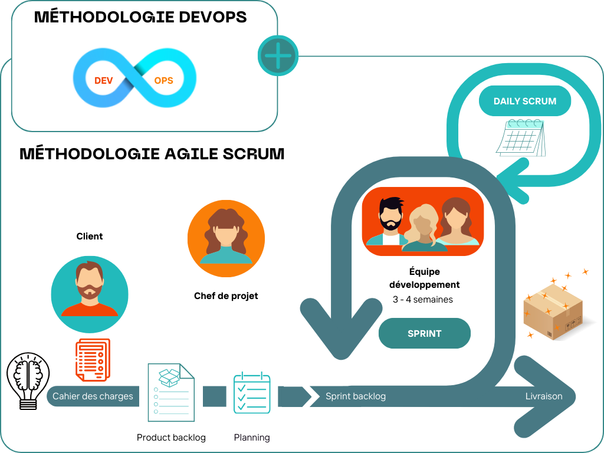
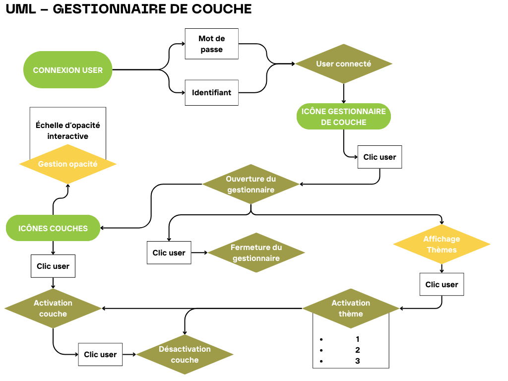

# Gestion de projet - 17/03/25
## Méthodes de recueil et d'analyse des besoins
FRANCK THUILLIER
 
### Conception et maintenance d'applications et d'interfaces SIG
Analyser le besoin est fondamental pour rendre le bon service au client. Il existe diffférentes méthodes d'expression du besoin qui dépendent de notre relation et de l'environnement du client.
Ainsi, on adapte sa réponse à l'interlocuteur.
   
*Expression de besoin* :
- Appel d'offre : rédiger le cahier des charges avec le cadre de réponse précis et détaillé,
- Cahier des charges interne : rescence l'ensemble des besoins du client (contrat déjà en place ou dans le cadre privé),
- Note d'expression du besoin / Tickets : format plus souple, souvent contrat déjà en place, pour des petites demandes ou évolution de la demande (méthodologie agile).

Il existe deux principales méthodologies de gestion de projet qui s'appliquent selon le type de structure et le type de projet :
- Cycle en V : adapté aux grands projets, très stricte,
- Agile : adapté à des projets peu définis en amont, plus souple.

#### I - Cycle en V

 Généralement, il faut rédiger le Cahiers des charges, les Spécifications Techniques (STG et STD), les Spécifications Fonctionnelles (SF) et le Dossier d'Architecture Technique (DAT). Ce processus est très strict et la documentation du code source est obligatoire, on utilise souvent Git.

#### II - Mode Agile

C'est un cycle court (sprints de 3/4 semaines) et les cycles se succèdent pour aboutir au produit. L'outil est livré petit à petit. On rédige un Backlog (liste itérative des fonctionnalités souhaitées par le client réparties sur chaque sprint). On utilise un panel d'outil : jira, monday, notion, teams, sharepoint. La gestion du code source est très importante, d'où l'utilisation de Git.
L'idée est d'avoir une continuité de service sur le livrable final, l'aspect DevOps intervient souvent dans la méthode Agile, c'est pourquoi on réalise de nombreux tests d'intégration.
 
#### III - TP : Analyse d'une note d'expression de besoin.
Groupe de 2/3. Rédaction d'un cahier des charges dont un porotypage IHM (Interface Homme Machine) et l'architecture technique envisagée.
Outil cartographique web permettant la prise de decision sur l'emplacement d'un commerce et l'analyse des commerces déjà existants. L'outil devra posséder plusieurs fonctionnalités :
- données permettant l'analyse du contexte socio-économique du commerce,
- statistique démographiques,
- analyse des contraintes de l'emplacement

# Gestion de projet - 18/03/25
## Méthodes de recueil et d'analyse des besoins
FRANCK THUILLIER
 
### Conception et maintenance d'applications et d'interfaces SIG

#### I - TP : Spécifications techniques et fonctionnelles détaillées (SFTD)
Déscription précise des fonctionnalités de l'outil. Les SF serviront aux déveveloppements et les ST seront amendées après le développement.
SFD : fianliser et intégrer la description de la fonctionnalité Gestionnaire de couches + définir un nouveau scénario où l'utilisateur rencontre un bug d'affichage d'une couche. 
STD : seules les données commerce, stationnement et arrêt de transport seront stockées dans la BDD, rédiger la description détaillée des couches + décrire rechniquement le fonctionnement de l'analyse spatiale de recherche des stationnements autour d'un commerce avec un paramètre permettant de définir un rayon.

#### II - Méthode Agile
Méthodologie de gestion de projet basée sur des courtes périodes de développement.
On peut créer différentes méthodes de gestion de projet sur Jira, on va essayer la méthode Scrum. On peut définir le backlog.
On va finalement essayer Notion car Jira a bloqué la création d'un site.

# Gestion de projet - 07/04/25
## Rappels et Acculturation IT
FRANCK THUILLIER
 

#### I - Réseaux informatiques
Modèle OSI : représentation théorique qui décompe les communications réseaux en 7 couches :

On utilise une adresse IP qui agit à un identifier unique sur le réseau. Les serveurs DNS et les noms de domaines sont des sortes d'annuaires. Les ports permettent d'identifier un service bien précis sur une machine.
Un protocole définit comment les données sont envoyées entre deux machines.

#### II - Équipements réseaux 
Un switch est un appareil qui fait la communication entre plusieurs appareils sur un réseau. Il possède une liste de l'ensemble des adresses IP connectées sur le réseau.
Un routeur permet d'interconnecter plusieurs réseaux, par exemple : un réseau local avec internet. Il segmente les différents réseaux.
Un firewall permet de filtrer le trafic via des règles de sécurité. Soit il bloque les connexions non autorisées, soit il autorise uniquement le trafic nécessaire.
Un serveur est un équipement qui fournit un ou plusieurs services réseau aux autres machines.

#### III - Virtualisation
C'est une technologie informatique permettant la création d'environnements informatiques isolés et flexibles au sein d'une seule machine physique.
La virtualisation matérielle est un environnement virtuel qui fonctionne comme s'il s'agissait d'un ordinateur phyisque.
Découper les machines virtuelles grâce à VMware.

#### IV - Docker
La conteneurisation en docker, contient l'application mais pas uniquement. Le conteneur embarque l'environnement entier de l'application (dépendances et variabbles de l'environnement). Ceci assure le bon fonctionnement de l'appli.
Si +ieurs appli fonctionnent sur le même serveur, elles doivent partager des dépendances et des ressources. Si l'une d'elles disfonctionne, cela peut poser provoquer des conflits.
Le cloisonnement des applications consiste à isoler chaque application pour qu'elle fonctionne indépendamment des autres.

Dans docker, il existe des images et des conteneurs.  
- *Image* : package autonome qui inclut tout ce dont une application a besoin pour fonctionner, construite à partir d'un Dockerfile,décrivant étape par étape la création de l'image, base pour créer un conteneur. 
- *Conteneur* : instance d'une image en cours d'exécution, environnement isolé et léger où l'appli tourne avec ses dépendances et partage le même noyau du syst. d'exploitation de l'hôte.
 
Docker compose est une appli qui permet de gérer du multiconteneur, il passe par la configuration d'un fichier yml.

#### V - Hosting & Cloud
Les Cloud providers proposent aussi des solutions de Cloud Computing. Ils permettent de déployer des services plus rapidement et plus facilement en interne.
Les Clouds providers ont +ieurs services :
- stockage,
- serveur applicatif,
- BDD,
- VPN
- DNS
- ... 
On distingue deux grands modes de tarification : **à l'utilisation** *Go/mois* (serveur de stockage) ou **à l'heure** *puissance/heure* (serveur deproduction)

#### VI - Dimensionnement
Un bon dimensionnement équilibre besoins métiers, ressources techniques et budget.
Il faut bien définir du besoin métier jusqu'à l'infrastructure pendant le phasage du projet. Le recueil du besoin est une étape importante. Il faut également estimer lal volumétrie des ressources. Aussi, il faut prendre en compte la charge applicative edt l'évaluer. Il faut traduire les ressources matérielles. Les types d'hébergement et la préparation du développement jusq'à la production doivent être faits.

